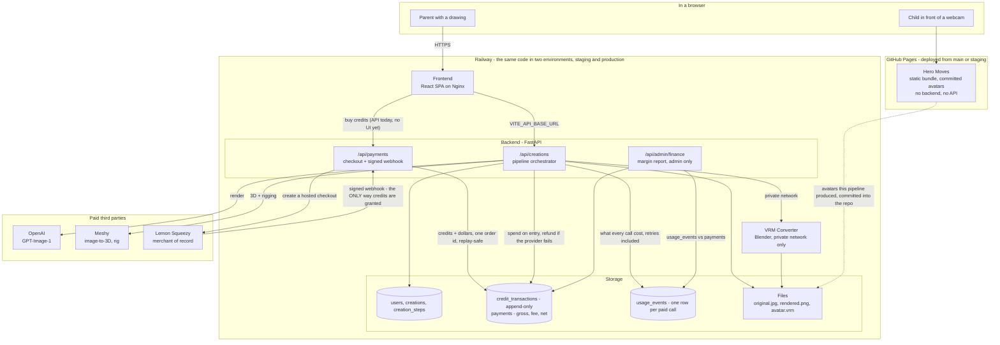

# HeroMaker

AI-powered character creation pipeline that transforms 2D images into 3D VRM avatars.


> Transform drawings into animated 3D characters in minutes

## Live

| What | Where |
|------|-------|
| **The product** | <https://heromaker.up.railway.app> |
| API docs | <https://heromaker.up.railway.app/docs> |
| Health | <https://heromaker.up.railway.app/health> |
| Public gallery (JSON) | <https://heromaker.up.railway.app/api/creations/> |
| **Hero Moves** (webcam party game) | <https://razk.github.io/HeroMaker/hero-moves/> |
| Hero Moves, camera-free prototype | <https://razk.github.io/HeroMaker/hero-moves/reel.html> |

The product deploys to Railway (`backend/`, `frontend/`,
`vrm-converter-service/`), which has **two environments, staging and
production**: a merge to `main` deploys to staging on its own, and production
takes a human running *Actions → Promote to production* and a reviewer
approving it. Hero Moves is not part of that deploy at all — it is a static
bundle published to GitHub Pages by `.github/workflows/pages.yml` on a push to
`main` or `staging`, because the game needs a camera and a camera needs a real
https origin. It ships with avatars the pipeline already made
(`games/hero-moves/assets/avatars/`) and talks to no backend.

A finished hero's files are served from
`/api/files/{user_id}/{creation_id}/{filename}`, where the useful names are
`original.jpg` (the drawing as photographed), `rendered.png` (the AI render)
and `avatar.vrm` (the rigged result). Prefix a filename with `thumb_` for a
thumbnail. That is how the marketing material in `marketing/` was assembled
from real heroes rather than mock-ups.

## Quick Start

For **daily development**, `./start-dev.sh` is the single command: it runs the
backend natively out of `.venv` on port 8000, the frontend on Vite's 5173, and
the VRM converter in Docker on 8001. Docker Compose below is for
production-like full-stack testing, not for day-to-day work.

### Full stack with Docker

**Prerequisites:**
- Docker and Docker Compose installed
- OpenAI API key
- Meshy API key

**Steps:**

1. Clone the repository:
   ```bash
   git clone <repository-url>
   cd HeroMaker
   ```

2. Set up environment:
   ```bash
   cp .env.example .env
   # Edit .env and add your API keys
   ```

3. Start services:
   ```bash
   docker-compose up -d
   ```

4. Verify it's running:
   ```bash
   curl http://localhost:8000/
   # Should return: {"message":"HeroMaker API is running"}
   ```

That's it! The API is now available at `http://localhost:8000`.

## Features

### 🎨 Complete Pipeline

- Complete end-to-end pipeline execution
- Automatic step-by-step processing
- Real-time progress tracking
- Complete pipeline in ~6 minutes

### 🎭 3D Model Viewer
- Interactive 3D model preview in the app (`ModelPreview.tsx`, three.js +
  `@react-three/fiber`)
- Rotate, zoom, and inspect models; download the `.vrm`
- The webcam in the web app is for **photographing the drawing**, nothing else

### 🕺 Hero Moves — the avatar copies a real child

- A separate webcam party game: <https://razk.github.io/HeroMaker/hero-moves/>
- Body pose only, MoveNet in the browser via TensorFlow.js — no frame is
  uploaded, because there is no backend to upload it to
- Any humanoid `.vrma`, and CC0 glTF mocap retargeted onto the VRM humanoid;
  the transform is rotation-only and so works on any body proportions
- No facial tracking: a pipeline avatar has 22 humanoid bones, no fingers and
  no blendshapes (`games/PLAYBOOK.md`)
- The GIF above is an **older in-app pose prototype**. No code for it remains
  in this repository; pose animation lives in `games/hero-moves/` now

### 📦 Creation Gallery

- Browse all your creations
- Quick access to completed avatars
- Download VRM files
- View creation history and details
- Each tile cross-fades between the drawing and the hero it became

### 💳 Credits, payments and the ledger
- A hero costs credits (`backend/app/config/packs.py` is the single price
  table; the packs today are $5/30, $15/100 and $40/300 credits)
- **Lemon Squeezy is the merchant of record.** `POST /api/payments/checkout`
  returns a hosted checkout URL; the signed webhook at
  `POST /api/payments/webhook` is the **only** path that grants credits — the
  browser is never trusted to say it paid
- Every movement of credits is a row in the append-only `credit_transactions`
  ledger; `users.credits` is only a cache of it. `external_ref` is UNIQUE, so
  a webhook delivered twice grants credits once
- `payments` records the dollars beside the credits, split gross / fee / net
- The pipeline spends credits per step and refunds them when a provider fails
- The API is live; the React app has no buy button yet, so buying happens
  through the API today

### 📊 Cost and margin
- Every paid provider call — including the failures and the retries — writes a
  `usage_events` row at the moment the money is spent
- `GET /api/admin/finance/margin` (and `margin.html`) reads those against
  `payments` to answer "what did this actually earn", admin-only

## Documentation

- **[Local Deployment](docs/deployment/local.md)** - Local Docker Compose setup and development
- **[Railway Deployment](docs/deployment/railway.md)** - Production deployment to Railway
- **[API Reference](docs/api/reference.md)** - Interactive Swagger UI docs
- **[Architecture](docs/architecture/overview.md)** - System design and overview
- **[CI/CD & environments](docs/deployment/cicd.md)** - staging vs production, and how to promote
- **[Backend Docs](docs/backend/)** - Backend implementation, database schema, integrations

## How It Works

HeroMaker orchestrates a multi-step AI pipeline to transform 2D drawings into fully rigged 3D VRM avatars:

1. **Image Processing** - Preprocess uploaded image
2. **OpenAI Render** - Enhance image using OpenAI's GPT-Image-1 model
3. **Meshy 3D** - Generate 3D model from image
4. **Meshy Rig** - Add rigging to 3D model
5. **VRM Conversion** - Convert GLB to VRM format using Blender
6. **Complete** - Finalize and store creation

## Architecture

Three deployed services, one pipeline, one ledger, and a game that is none of
those things.



**Key Architecture Decisions:**
- **Frontend → Backend**: Direct calls via `VITE_API_BASE_URL` (no proxy needed)
- **Backend → VRM Converter**: Private network communication (Docker network locally, Railway private network in production)
- **Storage**: Shared volume (local) or S3 + PostgreSQL (production)
- **Stateless Frontend**: Pre-built static files, no server-side rendering
- **Credits are a ledger, not a number**: balances are derived from
  `credit_transactions`, which is append-only; a correction is a compensating
  row, never an UPDATE
- **The webhook is the trust boundary for money**: HMAC-SHA256 verified before
  anything else happens, and the user credited comes from `custom_data.user_id`
  that we put into the checkout, never from the buyer's email
- **Cost is recorded on its own transaction**: a usage row is committed even if
  the pipeline's transaction later rolls back, because the money was still spent
- **Hero Moves is deliberately outside all of this**: no backend, no API key, no
  Railway service — the webcam never leaves the browser

## Deployments

| | |
|---|---|
| PR | builds and lints, deploys nothing |
| merge to `main` | auto-deploys all three services to **staging** |
| production | *Actions → Promote to production*, approved by a reviewer |
| rollback | the same workflow, an earlier SHA |

Railway service and environment IDs live in exactly one file,
`devops/railway/project.json`, and reach the workflows through the
`railway-config.yml` reusable workflow. Environment variables are layered
files under `devops/railway/env/`, pushed with `devops/scripts/railway-env.sh`.
See [docs/deployment/cicd.md](docs/deployment/cicd.md).

## Tech Stack

### Frontend
- **React 18** + **TypeScript** - Modern UI framework
- **Three.js** + **@react-three/fiber** - 3D model rendering
- **Vite** - Fast build tool and dev server

### Backend
- **FastAPI** - High-performance Python API
- **SQLite/PostgreSQL** - Database (SQLite for dev, PostgreSQL for prod)
- **SQLAlchemy + Alembic** - Models and migrations
- **JWT + bcrypt** - Accounts and sessions
- **Lemon Squeezy** - Merchant of record for credit packs
- **Docker** - Containerized services

### Games
- **Hero Moves** - TypeScript + Vite + three.js + `@pixiv/three-vrm`, pose
  tracking in the browser with TensorFlow.js. Deployed to GitHub Pages, not to
  Railway. See `games/PLAYBOOK.md`.

### Services
- **Backend API** - FastAPI service (port 8000 locally, dynamic port on Railway)
- **Frontend** - React app (Vite dev server locally, Nginx in production)
- **VRM Converter** - Blender-based service for GLB→VRM conversion (port 8001 locally, private network only in production)

## Development

`./start-dev.sh` starts everything locally. See
[docs/deployment/local.md](docs/deployment/local.md) for the Docker path and
`.env.example` for backend configuration options. Python always runs out of the
project venv: `.venv/bin/python`, `.venv/bin/pip`.

## License

[Add your license here]

