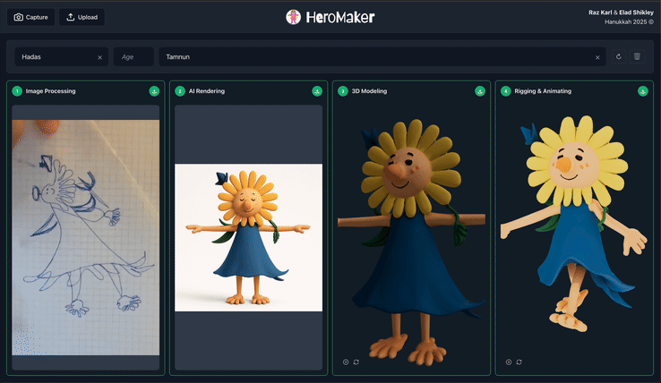
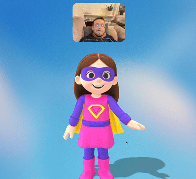
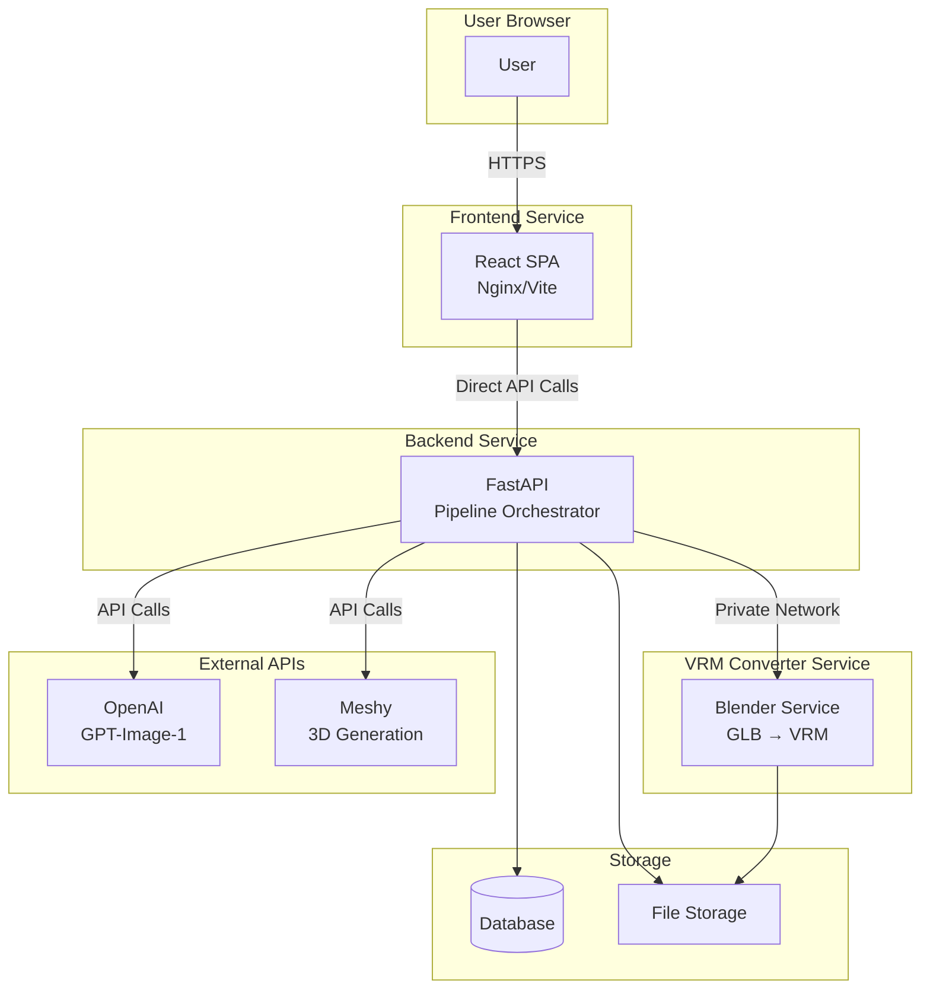

# HeroMaker

AI-powered character creation pipeline that transforms 2D images into 3D VRM avatars.



> Transform drawings into animated 3D characters in minutes

## Quick Start with Docker

**Prerequisites:**
- Docker and Docker Compose installed
- OpenAI API key
- Meshy API key

**Steps:**

1. Clone the repository:
   ```bash
   git clone <repository-url>
   cd HeroMaker
   ```

2. Set up environment:
   ```bash
   cp .env.example .env
   # Edit .env and add your API keys
   ```

3. Start services:
   ```bash
   docker-compose up -d
   ```

4. Verify it's running:
   ```bash
   curl http://localhost:8000/
   # Should return: {"message":"HeroMaker API is running"}
   ```

That's it! The API is now available at `http://localhost:8000`.

## Features

### 🎨 Complete Pipeline

- Complete end-to-end pipeline execution
- Automatic step-by-step processing
- Real-time progress tracking
- Complete pipeline in ~6 minutes

### 🎭 3D Model Viewer & Pose Animation

- Interactive 3D model preview
- Real-time pose animation from webcam
- Rotate, zoom, and inspect models
- Live facial tracking and body pose detection

### 📦 Creation Gallery

- Browse all your creations
- Quick access to completed avatars
- Download VRM files
- View creation history and details

## Documentation

- **[Local Deployment](docs/deployment/local.md)** - Local Docker Compose setup and development
- **[Railway Deployment](docs/deployment/railway.md)** - Production deployment to Railway
- **[API Reference](docs/api/reference.md)** - Interactive Swagger UI docs
- **[Architecture](docs/architecture/overview.md)** - System design and overview
- **[Backend Docs](docs/backend/)** - Backend implementation, database schema, integrations

## How It Works

HeroMaker orchestrates a multi-step AI pipeline to transform 2D drawings into fully rigged 3D VRM avatars:

1. **Image Processing** - Preprocess uploaded image
2. **OpenAI Render** - Enhance image using OpenAI's GPT-Image-1 model
3. **Meshy 3D** - Generate 3D model from image
4. **Meshy Rig** - Add rigging to 3D model
5. **VRM Conversion** - Convert GLB to VRM format using Blender
6. **Complete** - Finalize and store creation

## Architecture

HeroMaker consists of three main services that work together:



**Key Architecture Decisions:**
- **Frontend → Backend**: Direct calls via `VITE_API_BASE_URL` (no proxy needed)
- **Backend → VRM Converter**: Private network communication (Docker network locally, Railway private network in production)
- **Storage**: Shared volume (local) or S3 + PostgreSQL (production)
- **Stateless Frontend**: Pre-built static files, no server-side rendering

## Tech Stack

### Frontend
- **React 18** + **TypeScript** - Modern UI framework
- **Three.js** + **@react-three/fiber** - 3D model rendering
- **Vite** - Fast build tool and dev server

### Backend
- **FastAPI** - High-performance Python API
- **SQLite/PostgreSQL** - Database (SQLite for dev, PostgreSQL for prod)
- **Docker** - Containerized services

### Services
- **Backend API** - FastAPI service (port 8000 locally, dynamic port on Railway)
- **Frontend** - React app (Vite dev server locally, Nginx in production)
- **VRM Converter** - Blender-based service for GLB→VRM conversion (port 8001 locally, private network only in production)

## Development

See [docs/deployment/local.md](docs/deployment/local.md) for Docker setup. See `.env.example` for backend configuration options.

## License

[Add your license here]

