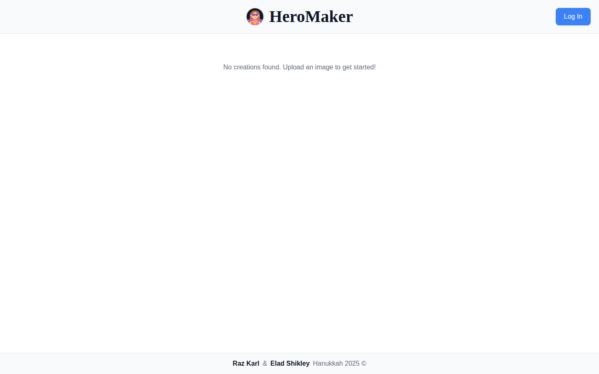
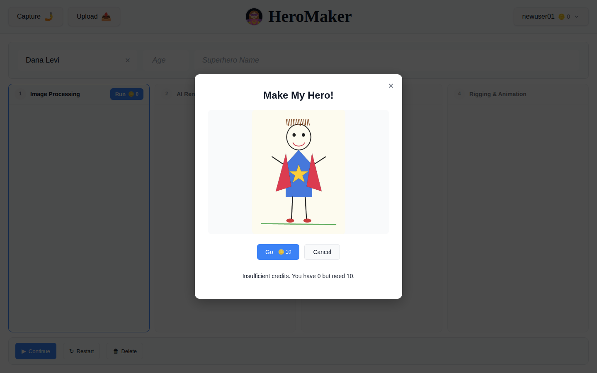
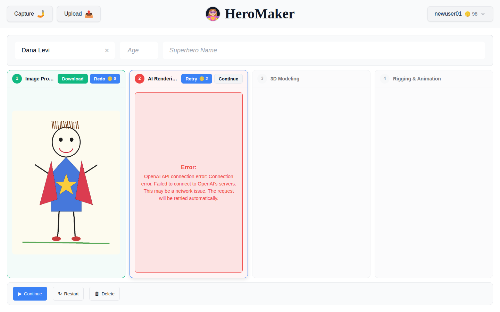
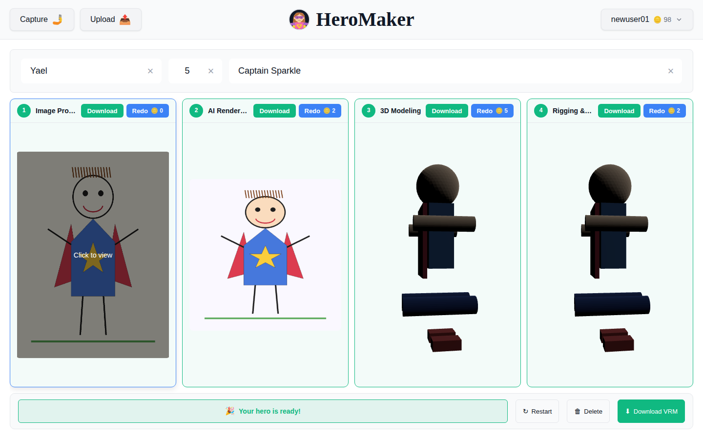
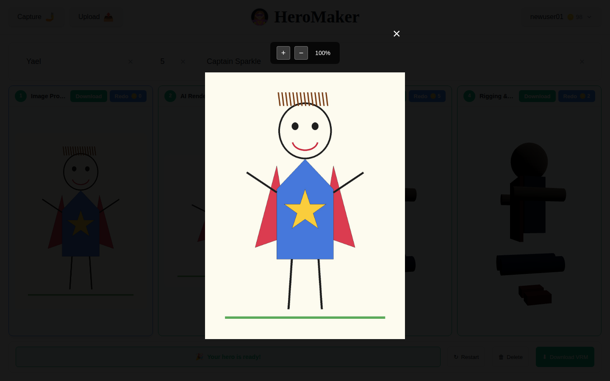
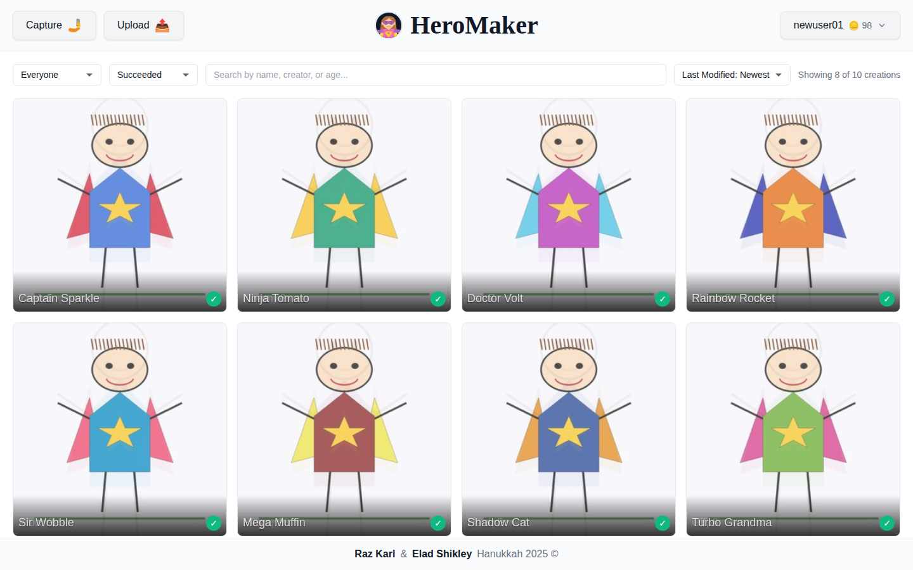
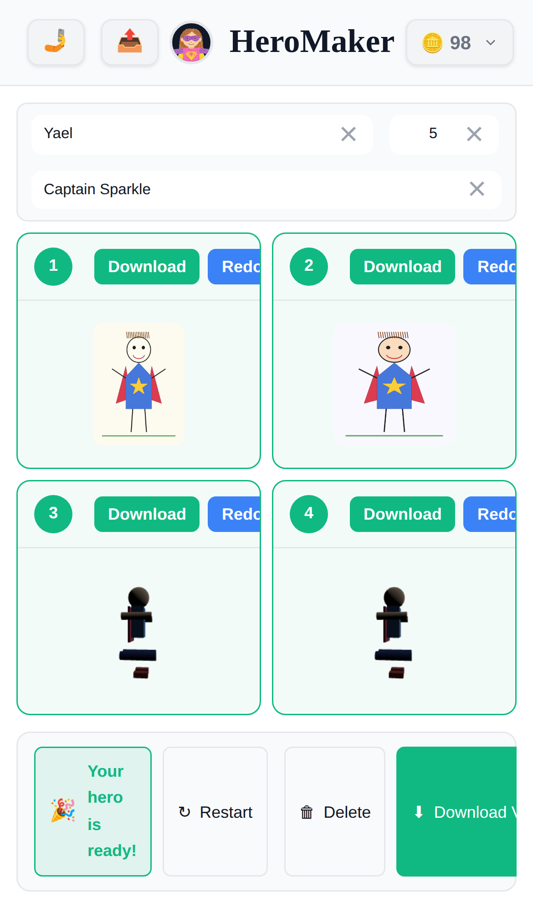

# HeroMaker product audit — August 2026

A walkthrough of HeroMaker as a first-time user, from landing page to finished
avatar, with measurements. The goal was to find what stands between the current
build and a product strangers can sign up for and pay for.

**Method.** The live deployment (https://heromaker.up.railway.app/) was unreachable
from the audit sandbox — an egress policy denied `CONNECT` for every non-allowlisted
host, so the app was run locally at the commit on `main` (backend + Vite frontend)
and driven with a real Chromium via Playwright at 1440×900 and iPhone 13 (390×844).
The pipeline's OpenAI/Meshy steps could not run without outbound access, so a set of
completed creations was seeded directly into the database with real image and GLB
assets to inspect the finished-creation screens.

**Caveat.** The 3D models in the screenshots are synthetic stand-ins built from
primitives, not real Meshy output. Judge the *layout and framing* from them, not the
model quality or shading.

---

## 1. The landing page sells nothing



A logged-out visitor at 1440×900 gets: an 81px header, one line of grey text
(*"No creations found. Upload an image to get started!"*), and a 51px footer
crediting two people and "Hanukkah 2025 ©". Measured: **~85% of the viewport is
empty white**, and `document.scrollHeight === 900` — there is nothing below the
fold either.

There is no explanation of what HeroMaker does, no example output, no pricing, no
sign-up button (only "Log In"), and no social proof. The one instruction on screen —
"Upload an image to get started" — is impossible to follow, because
`HeaderUploadButtons` returns `null` when logged out.

The public gallery is also the marketing surface, and it is empty for a new visitor
whose filter defaults to `everyone` + `completed`. The single best asset the product
has (other people's finished heroes) is not used to sell it.

## 2. A new account cannot create anything, and cannot pay



Signup asks for **five fields** — username, email, name, date of birth, password —
with no social login, no explanation of why a birth date is needed, and no
terms/privacy links. `backend/app/api/auth.py` then creates the user with
`credits=0`, while a creation costs **10 credits** (`backend/app/config/steps.py`).

So the funnel terminates immediately after signup:

> **Insufficient credits. You have 0 but need 10.**

rendered as grey body text under a disabled "Go" button. There is **no way to buy
credits anywhere in the product** — no payments integration, no pricing page, no
upsell. The only path to a non-zero balance is `add_credits()`, whose sole caller is
the coupon redemption service. Every organic signup dead-ends here.

## 3. Failed steps still charge the customer



`execute_step()` in `backend/app/services/pipeline.py` deducts credits *before*
running the step (line ~536), and **no refund path exists anywhere in the backend** —
`grep -ri refund backend/` returns nothing, and `add_credits()` is only ever called
by coupons.

Observed directly: the `openai_render` step failed, and the balance went **100 → 98**
anyway. The user paid 2 credits for a step that produced nothing. On a paid product
this is a chargeback generator.

The failure UX compounds it. The error surfaced to a consumer is raw plumbing —
*"OpenAI API connection error: Connection error. Failed to connect to OpenAI's
servers. This may be a network issue. The request will be retried automatically."* —
and the promised automatic retry never happened; the step sat failed for the full
90s observation window.

## 4. Dead space around the images — measured



The completed-creation view splits the viewport into **four equal 341×592 columns**,
giving the original scan and the finished rigged avatar identical real estate. The
product's payoff — the 3D hero — renders in a **311px-wide canvas**, one quarter of
the screen, sitting beside intermediate artifacts nobody asked to see.

Measured at 1440×900:

| Region | Size | Note |
|---|---|---|
| Name/age/hero-name band | 1400×89 | three inputs; the hero-name field alone is ~930px wide |
| Step grid | 1400×592 | 4 × (341×592) cards |
| — media inside card 1 | 317×423 | 66% of card area |
| — media inside card 2 | 311×311 | **48%** of card area |
| — media inside cards 3–4 | 311×513 | 79% of card area |
| Control bar | 1400×74 | a ~1000px-wide strip holding "🎉 Your hero is ready!" |

Roughly **a third of the card area is padding**, and the actual imagery accounts for
about **42% of the viewport**.

Card titles truncate at this ordinary laptop width — "Image Pro…", "AI Render…",
"Rigging &…" — because the Download/Redo buttons crowd the header row.

The lightbox is worse:



`.image-preview-zoomed` is capped at `max-height: 70vh` with `object-fit: contain`,
so a portrait image opens at **473×630 in a 1440×900 viewport — 23% of the screen**,
surrounded by 77% black overlay, with the zoom control floating detached above it.
The 3D preview modal is better but still only reaches **41%** of the viewport.

**The gallery, by contrast, is the strongest screen** — the grid fills the width and
the cards are dense and readable. It is the layout model the rest of the app should
follow.



(Two nits there: the name label at the card's bottom edge is clipped on descenders
and collides with the progress bar; and nothing in the gallery communicates that
these are *3D* characters — the differentiator is invisible.)

## 5. Mobile is broken, not just cramped



At iPhone 13 width the desktop 2×2 grid is simply squeezed:

- Step cards become **179×173px** — the finished 3D hero renders in a box smaller
  than a postage stamp.
- "Redo" buttons are **clipped mid-word** by the card edge ("Redc").
- "Download VRM", the primary CTA, is cut off at the viewport edge.
- "🎉 Your hero is ready!" wraps onto four lines inside a narrow box.

For a product whose input is a photo of a child's drawing, the phone is the primary
device. This screen is not shippable as-is.

## 6. First load is heavier than it needs to be

Production build (`npx vite build`):

```
dist/assets/three-QzaYcFYd.js   817.59 kB │ gzip: 221.24 kB
dist/assets/vendor-F9Y4d3HK.js  140.88 kB │ gzip:  45.26 kB
dist/assets/index-Bny6MzX4.js   122.26 kB │ gzip:  33.56 kB
dist/assets/index-DKp-yJAE.css   67.89 kB │ gzip:  10.15 kB

PWA precache  12 entries (3945.16 KiB)
```

Two concrete problems:

1. **817 KB of three.js is in the critical path** of every visit, including the
   landing page and gallery, which render no 3D at all. It is not lazy-loaded.
2. **~2.9 MB of logo PNGs ship and are precached.** `dist/` contains `logo.png`
   (1.9 MB) and `logo-head.png` (436 KB) that **nothing in `src/` references**, plus
   `logo-head-transparent.png` (528 KB, 586×586) which *is* used — displayed at about
   40px in the header. The service worker's
   `globPatterns: ['**/*.{js,css,html,ico,png,svg,woff2}']` sweeps all of them into a
   **3.9 MB precache** on first visit.

Also: `index.html` blocks on a Google Fonts stylesheet for the brand font
(`Barriecito`) with no local fallback, adding a third-party round trip before first
paint.

## 7. Smaller findings

- **Gallery fetches everything.** `CreationGallery` calls
  `api.listCreations(0, 0, mineOnly)` — deliberately unpaginated, "backend returns
  all" — then renders every row. Fine at 10 creations, a cliff at 10,000. The
  request also fires twice on load.
- **No shareable output.** The finished-creation control bar offers only Restart,
  Delete, and Download VRM. A `.vrm` file is meaningless to a parent. The only share
  affordance in the product is a "copy kalidoface.com link" button buried inside one
  step card.
- **Progress has no whole-pipeline view.** Steps show individual ETAs, but the ~7
  minute total (`sum(estimated_duration)` ≈ 410s) is never surfaced, and there is no
  email/notification on completion — the user must sit and watch.
- **Polling only.** Progress uses a 2s `setInterval` against `GET /api/creations/{id}`
  per viewer.
- **Console noise in production.** `console.log` of creation IDs, statuses and image
  URLs on every gallery load and poll.
- **Admin "bright mode" is coupled to `is_admin`**, so admins never see what
  customers see.
- **Footer says "Hanukkah 2025 ©"** and credits two individuals — a gift-project
  artifact, not a commercial product's footer.

---

## What to fix first

Three items, in dependency order. (1) is the only one that unblocks revenue at all;
(2) is what makes people want to pay; (3) is what makes them tell someone else.

### 1. A commercial front door: landing page → payment → credits

Nothing else matters while a stranger cannot understand the product or buy it.

- A real landing page above the gallery: what it does, a before/after example, the
  ~7-minute expectation, pricing, and a primary "Make your hero" CTA.
- Payments (Stripe Checkout is enough) with credit packs, plus a pricing page and a
  visible "Buy credits" entry point from the credit chip and from the insufficient-
  credits state — which should become an upsell, not an error message.
- Give new accounts enough free credits for one hero, or a watermarked free preview.
  A signup that can do nothing has no reason to convert.
- Trim signup to email + password (+ OAuth); drop date of birth or ask for it later.
- **Refund credits on step failure**, and wrap external-API errors in human language.
  Charging for failed work will produce disputes the moment real money is involved.

### 2. Make the hero the hero: rebuild the creation view around the output

The finished avatar should own the screen; the pipeline is behind-the-scenes detail.

- Promote the final 3D avatar to a large, interactive stage (target ≳70% of the
  viewport), with the four pipeline steps demoted to a filmstrip of thumbnails
  beneath it that swap what the stage shows.
- Raise the lightbox cap from `70vh` to ~`92vh`/`92vw` and let the 3D modal go
  effectively full-bleed; move zoom controls into the frame.
- Give the step cards a real mobile layout — single-column stack, full-width buttons,
  no clipped labels — and let the 3D stage fill the phone screen.
- Fix the truncated card titles at 1440px and the clipped gallery name labels.
- Add a whole-pipeline progress bar with total ETA, and email the user when the hero
  is ready so they can close the tab.

### 3. Make the result shareable, and make first paint fast

The output is inherently viral; today it is a file download.

- A public hero page per creation (`/hero/{id}`) with an embedded 3D viewer, OG/Twitter
  card images, and a "Make your own" CTA — that page becomes the top acquisition channel.
- One-tap share: copy link, plus an auto-generated turntable MP4/GIF for WhatsApp and
  Instagram, which is what parents will actually send. Promote sharing to the control
  bar next to Download VRM.
- Performance: lazy-load the three.js chunk so it is fetched only when a 3D view
  mounts; resize the header logo to ~64px (≈4 KB) and delete the two unreferenced
  logo PNGs; scope the PWA `globPatterns` so 3.9 MB is not precached on first visit;
  self-host the brand font with a fallback.
- Paginate the gallery and drop the duplicate initial request before creation volume
  makes it a problem.
