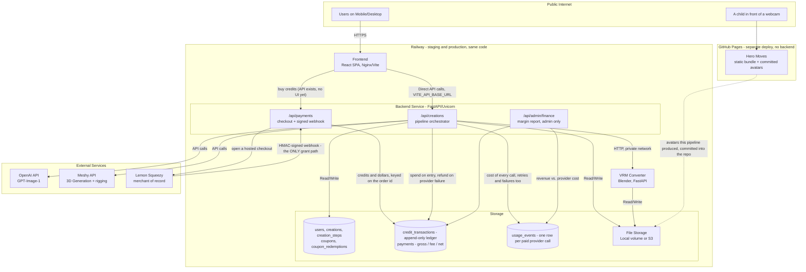
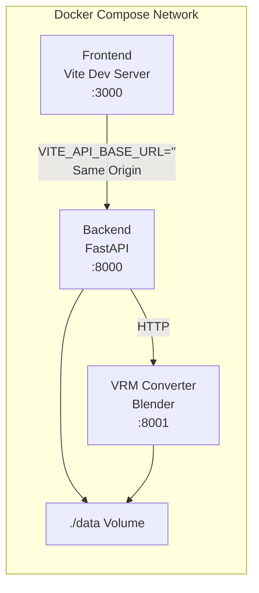
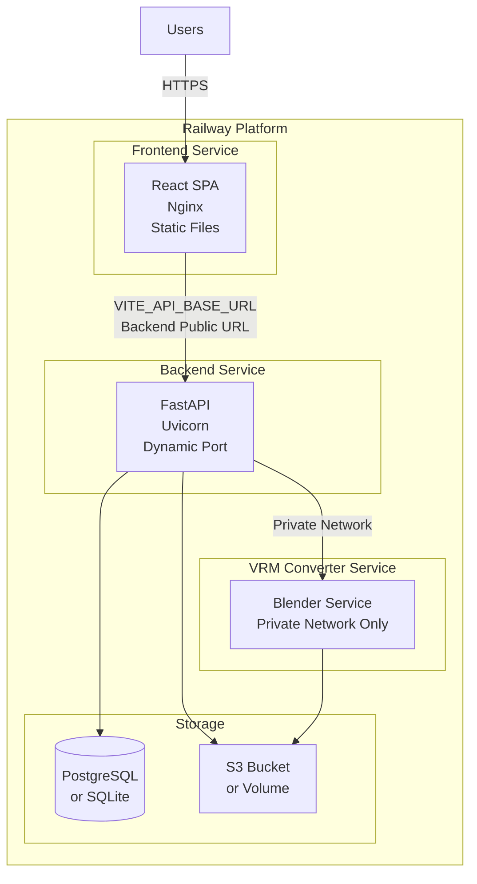

# HeroMaker Architecture Overview

This document provides the high-level system view that ties together the detailed references in the rest of the documentation set. Use it to understand how the product experience, backend services, storage model, and external integrations collaborate to turn a child's drawing into a downloadable VRM avatar.

## System Architecture Diagram



**What the money path guarantees**

- `credit_transactions` is append-only. A balance is the sum of its rows;
  `users.credits` is a cache updated in the same transaction. A correction is a
  compensating row, never an UPDATE.
- `credit_transactions.external_ref` and `payments.provider_ref` are both
  UNIQUE, so a webhook Lemon Squeezy delivers twice grants credits once. It
  will deliver twice.
- A debit is one conditional UPDATE (`... WHERE credits + :delta >= 0`), so
  concurrent spends cannot overdraw a balance.
- `usage_events` rows are written on their own session and committed
  immediately, independent of the caller's transaction: the money is gone the
  moment the provider accepts the request, so the record must not roll back
  with the pipeline.

## Deployment Architecture

### Local Development



**Key Points:**
- Frontend runs Vite dev server for hot reload
- Frontend calls backend via same origin (no proxy needed)
- All services share `./data` volume for files and database

### Production (Railway)



**Key Points:**
- Frontend is pre-built static files served by Nginx
- Frontend calls backend directly via public URL (`VITE_API_BASE_URL`)
- No nginx proxy - simplified architecture
- Backend and VRM converter communicate via Railway's private network
- Storage uses Railway managed services (PostgreSQL + S3) or volumes

### Two Railway environments

The same three services exist twice, as `staging` and `production`, with
separate data:

| | |
|---|---|
| PR | builds and lints, deploys nothing |
| merge to `main` | auto-deploys all three services to **staging** |
| production | *Actions → Promote to production*, approved by a reviewer |
| rollback | the same workflow, an earlier SHA |

Every Railway project, service and environment ID lives in exactly one file,
`devops/railway/project.json`, and reaches the workflows through the
`railway-config.yml` reusable workflow. Environment variables are layered
files under `devops/railway/env/` pushed by `devops/scripts/railway-env.sh`;
secrets are Railway shared variables referenced as `${{shared.KEY}}` and are
never committed. A project token is scoped to ONE environment, which is why
the staging job uses its own `RAILWAY_STAGING_TOKEN`. See
[CI/CD](../deployment/cicd.md).

### Hero Moves is not deployed here

`games/hero-moves` is a static Vite bundle published to GitHub Pages by
`.github/workflows/pages.yml` on a push to `main` or `staging`. It has no
backend, no API key and no Railway service: it ships avatars the pipeline
already produced, and pose tracking runs in the browser. It is separate
because a webcam needs a real https origin.

## Product Experience at a Glance

HeroMaker exposes three primary states in the frontend experience:

1. **Browse** – `CreationGallery` lists every finished hero as a square tile that cross-fades between the child's drawing and the render it became.
2. **Create** – A guided workflow that starts by uploading an image (`POST /api/creations/upload`), which creates the creation and then streams progress as backend steps run.
3. **Show** – Presents an individual character with its VRM file, thumbnails, and step history once the pipeline finishes.

The frontend treats the backend as the single source of truth and polls for creation/step progress every ~2 seconds while a hero is being built.

## Component Architecture

| Component | Responsibilities | Tech / Interfaces | Notes |
|-----------|------------------|-------------------|-------|
| Frontend Web Client | Browse gallery, trigger creations, upload scans, display progress/VRM viewer | React 18 + TypeScript + Vite. Communicates via REST over HTTPS. | Stateless; uses polling instead of websockets for simplicity. Calls backend directly via `VITE_API_BASE_URL` (no proxy). |
| Backend API Service | Implements REST endpoints under `/api`, orchestrates step execution, enforces auth/ownership rules | FastAPI + SQLAlchemy + Alembic. Runs under Uvicorn/Gunicorn. | Keeps business logic in app modules (`api/`, `services/`, `config/`, `utils/`). Listens on Railway-assigned port (via `PORT` env var). |
| Pipeline Engine | Encapsulated inside the API service (no separate worker). Executes sequential steps defined in `steps.md`, spawns Meshy/OpenAI jobs, and writes outputs to disk. | Python modules in `backend/app/services/`. | Step status is tracked in database with timestamps and progress. |
| VRM Converter Service | Converts GLB files to VRM format using Blender and VRM add-on | FastAPI + Blender. Runs as separate container/service. | Accessible only via private network (Railway) or Docker network (local). |
| Database | Stores users, creations, creation_steps, the credit ledger, payments and usage events | SQLite (dev and production). PostgreSQL supported via `DATABASE_URL` (see `.env.example`). | Tables: `users`, `creations`, `creation_steps`, `coupons`, `coupon_redemptions`, `credit_transactions`, `payments`, `usage_events`. File paths are not stored here. |
| Payments | Opens Lemon Squeezy checkouts and receives their signed webhook; the webhook is the only thing that grants credits for money | `backend/app/api/payments.py`, `services/lemonsqueezy.py`. HMAC-SHA256 signature verified first, constant-time. | The credited user comes from `custom_data.user_id` that we put into the checkout, never from the buyer's email. Refunds are logged for an admin, not clawed back automatically. |
| Credit ledger | Every movement of credits, append-only, replay-safe and impossible to overdraw | `backend/app/services/ledger.py`; `credit_transactions`. | `users.credits` is a cache of this table, written in the same transaction. `services/credits.py` is a thin compatibility wrapper. |
| Cost capture | One row per paid provider call, including failures and retries | `backend/app/services/usage.py`; `usage_events`, priced from `config/pricing.py`. | Written on its own session and never allowed to raise: bookkeeping must not break the pipeline earning the money. |
| Finance reporting | Margin per hero and per period, JSON and an HTML page | `backend/app/api/finance.py`, `services/reporting.py`, mounted at `/api/admin/finance`. | Admin only. Margin is computed against NET revenue, because gross margin against gross flatters by roughly the processor's cut. |
| File Storage | Holds all intermediate and final artifacts (`/data/files/{user_id}/{creation_id}/`) | Local POSIX filesystem (dev) or S3-compatible storage (production). | Directory structure encodes `user_id` and `creation_id`; files are stored directly in creation directory. |
| External Services | OpenAI for render + naming, Meshy for 3D pipeline | HTTP APIs (OpenAI, Meshy). | API polling intervals and retries defined in `integrations.md`. |

## Service Interactions

### Frontend-Backend Communication

**Local Development:**
- Frontend (Vite dev server) calls backend via same origin (`VITE_API_BASE_URL=''`)
- No proxy needed - direct HTTP calls within Docker network

**Production (Railway):**
- Frontend (static files served by Nginx) calls backend via public URL
- `VITE_API_BASE_URL` set to backend's Railway public URL (e.g., `https://backend.railway.app`)
- No nginx proxy - frontend JavaScript makes direct fetch calls to backend
- Simplified architecture: no certificate issues, no proxy configuration needed

### Pipeline Flow

1. **Creation Kickoff**  
   `POST /api/creations/upload` accepts an image file upload, creates a row in `creations`, initializes all steps as "pending", and allocates a filesystem workspace (`/data/files/{user_id}/{creation_id}/`).

2. **Pipeline Execution**  
   User triggers pipeline via `POST /api/creations/{id}/run` or individual steps via `POST /api/creations/{id}/steps/{step_name}/run`. Steps execute sequentially, with dependencies validated automatically.

3. **Automated Step Chain**  
   Each step definition (`steps.md`) specifies its dependency and expected output filename. Step status is tracked in the database with timestamps and progress percentages.

4. **External API Jobs**  
   For OpenAI and Meshy steps, the backend records provider task IDs in `creations.metadata`, polls on a configurable cadence, and updates step progress percentages so the frontend can render progress bars.

5. **VRM Conversion**  
   Backend sends GLB file to VRM converter service via private network (`http://vrm-converter:8000`). VRM converter reads GLB from shared storage, converts to VRM, writes back to storage.

6. **Completion**  
   After `convert_vrm` succeeds, the `complete` step sets `current_step` to null and marks the creation `status='completed'`. All files remain in the creation directory.

## Data Model & Storage Strategy

- **Relational Core** – Durable metadata (users, creations, creation_steps with timestamps, status, progress, optional error messages) lives in SQLite (or PostgreSQL via `DATABASE_URL`). See `database.md` for exact DDL.
- **Money and cost** – `credit_transactions` (append-only, UNIQUE `external_ref`), `payments` (gross / fee / net in USD micros, UNIQUE `provider_ref`) and `usage_events` (provider, step, creation, cost in USD micros) live in the same database. Integers throughout: money is never a float.
- **Filesystem Storage** – Output artifacts are stored in organized directory structure. Step status is tracked in database, not inferred from files. The backend wraps file operations in helper utilities.
- **Path Convention** – Every path includes the `user_id` of the account that owns the creation and the immutable `creation_id`, e.g. `/data/files/{user_id}/{creation_id}/rendered.png`. VRM files are named `avatar.vrm` in each creation directory.

### Data Directory Structure

The system uses a single `/data` directory for all persistent data, organized as follows:

```
/data/
├── files/           # User uploads and generated files
│   └── {user_id}/
│       └── {creation_id}/
│           ├── original.jpg
│           ├── rendered.png
│           ├── model.glb
│           └── avatar.vrm
└── db/              # Database
    └── heromaker.db
```

**Benefits:**
- ✅ Single volume mount point (`/data`) - works with Railway's single volume limitation
- ✅ Clean organization: files and database separated
- ✅ Easy to backup (everything in one place)
- ✅ Consistent across local and production environments

**Configuration:**
- **Volume mount**: `/data` (or `/app/data` in containers)
- **Environment variables**:
  - `FILES_ROOT=/data/files` (or `/app/data/files` in containers)
  - `DATABASE_URL=sqlite:////data/db/heromaker.db` (or `sqlite:////app/data/db/heromaker.db` in containers)
- **All services** (backend, vrm-converter) mount the same volume at `/data` to share files

**File Path Convention:**
Files are stored using the pattern: `{FILES_ROOT}/{user_id}/{creation_id}/{filename}`
- Example: `/data/files/{user_id}/{creation_id}/rendered.png`
- The code uses `FILES_ROOT` environment variable, which defaults to `/data/files` in production

## Error Handling & Resilience

- REST responses follow standard HTTP status codes. See [API Reference](../api/reference.md) for interactive docs.
- Transient Meshy/OpenAI failures are automatically retried (3 attempts, exponential backoff). Persistent failures set step `status='failed'` and capture context in `creation_steps.error_message`.
- Users can manually retry a step by calling `POST /api/creations/{id}/steps/{step_name}/run`, which resets the step and re-executes it.
- Step state is stored in database, allowing the system to resume from the last incomplete step after restarts.

## Deployment & Environment Strategy

- **Development** – SQLite, permissive CORS, local `/data` folder. `./start-dev.sh` runs the backend natively out of `.venv` with hot reload, the frontend on Vite, and the VRM converter in Docker.
- **Staging and production** – Two Railway environments running the same images from the same commit, with separate data. Accounts are real: bcrypt password hashing and JWT bearer tokens (`backend/app/services/auth.py`); the `debug-user-uuid` constant is defined in `auth.py` and referenced nowhere outside the tests. Still open: PostgreSQL by default, locked-down CORS origins and rate limiting. See `.env.example`.
- **Background Processes** – No separate worker today; FastAPI process handles both HTTP requests and polling loops. Webhook support from Meshy would allow offloading polling and is a future enhancement.

## External Integrations Summary

- **OpenAI GPT-Image-1** – Turn cleaned scans into rendered images + suggested names. Requires uploading the `scanned.jpg` as base64 and polling thread runs (`integrations.md`).
- **Meshy API** – Handles the heavy 3D lift. We either use the consolidated `image-to-3d` flow (preferred) or the discrete steps (remesh, retexture, rig, animate). Task IDs chain together; progress is mirrored back into `creations.metadata`.
- **Blender VRM Pipeline** – `vrm-converter-service` uses Blender with the VRM add-on to convert the final GLB into a VRM. Bone validation is performed automatically.
- **Lemon Squeezy** – Merchant of record for credit packs. `services/lemonsqueezy.py` opens hosted checkouts and verifies the webhook signature; it is the only module that talks to them. Test and live stores are the same code with different environment variables.

## Roadmap & Open Questions

- **A buy button** – `/api/payments/checkout` works; the React app has no UI for it yet, so buying credits goes through the API.
- **Auth Hardening** – JWT + bcrypt are in place; what is left is consistent enforcement and rate limiting on every endpoint.
- **Scaling Step Execution** – Introduce a worker queue (Celery, RQ, or managed alternative) so long-running Meshy conversions do not block API workers.
- **Webhook Adoption** – Replace Meshy polling with webhook receivers once keys are provisioned, reducing latency and cost.
- **Cloud Storage** – Migrate `/data/files/` to object storage for durability and CDN-backed downloads.
- **Rigging Quality Assurance** – Automate bone completeness checks prior to VRM conversion and feed failures back to users with actionable messaging.

For implementation details, cross-reference:

- [API Reference](../api/reference.md) for endpoint contracts
- [Step Configuration](../backend/steps.md) for the exact step definitions
- [Backend Integrations](../backend/integrations.md) for external API configuration
- [Backend Integrations](../backend/integrations.md) for external API call patterns
- [Database Schema](../backend/database.md) for persistence details
