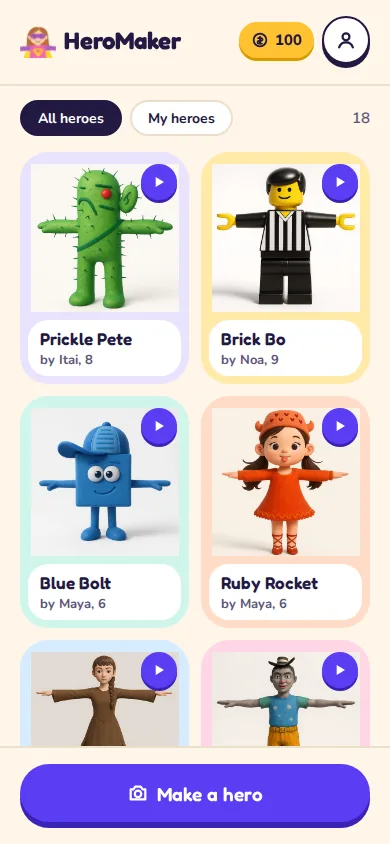
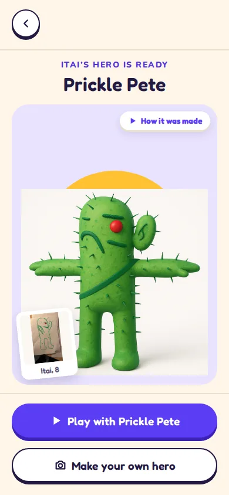
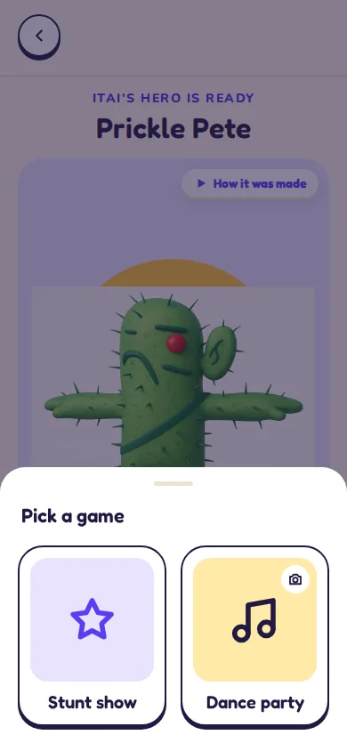
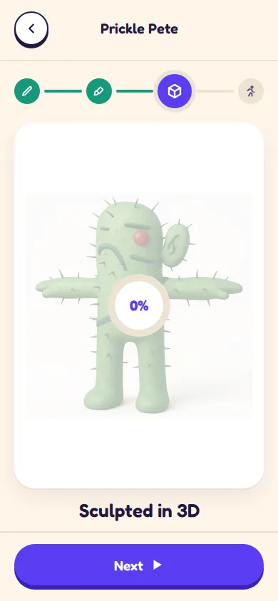
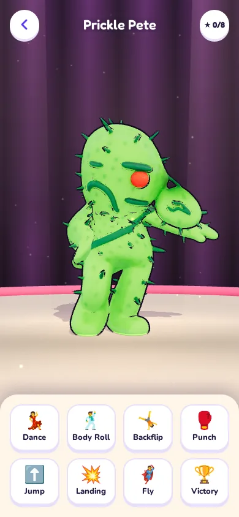
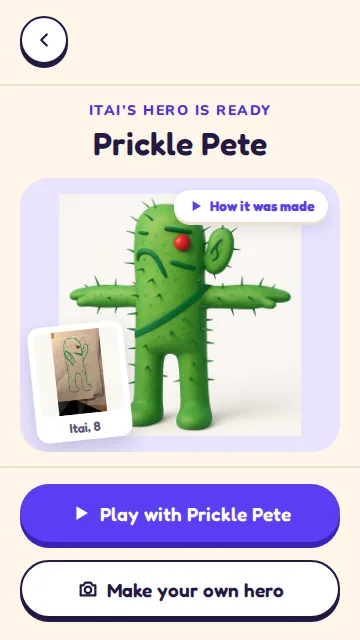
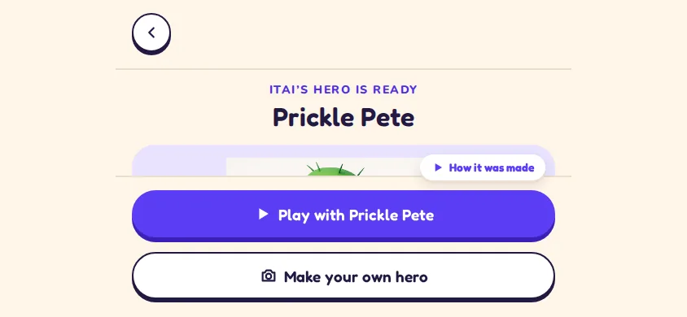
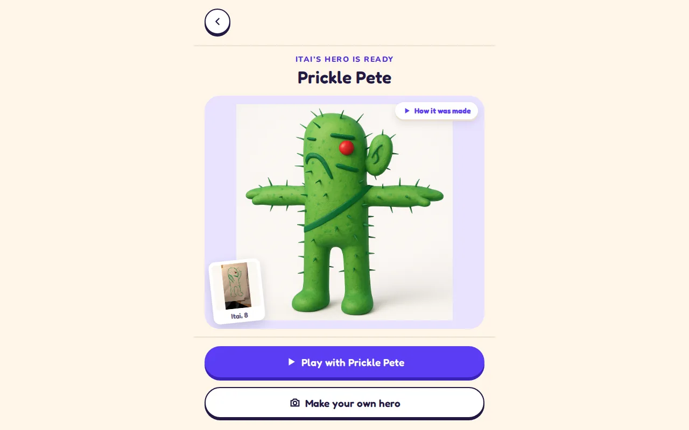

# HeroMaker brand book: Toy Box

**The hero is a toy; the UI is its packaging.** Read this before any UI work. Every rule came from a real rejection or decision by Raz. If a screen breaks a rule, the screen is wrong.

- Visual version (live components, swatches, do/don't pairs): <https://claude.ai/artifact/XESKFupFdphrXKy6JzH2LH>
- Source of truth: `frontend/src/styles/toybox.css`, `frontend/src/components/tb/`, `games/hero-moves/src/ui/reel.css`. Token names below are the CSS variables there.

| Gallery | A ready hero | Pick a game | 3D loading | Stunt show |
|---|---|---|---|---|
|  |  |  |  |  |

## Identity

One theme. No dark mode.

| Token | Value | Use |
|---|---|---|
| `--tb-grape` | `#5B3DF5` | The one primary action per screen; "what is happening now" |
| `--tb-grape-deep` | `#3A22B8` | Grape's depth and shadows only |
| `--tb-grape-text` | `#4B2FE0` | Grape as text (links, eyebrow, ETA) |
| `--tb-sun` | `#FFC233` | Celebration: the sun behind a ready hero, credits, Best value, combos |
| `--tb-sun-deep` | `#D99A00` | Depth under the credits pill |
| `--tb-ink` | `#231942` | All text; outline + depth of secondary controls |
| `--tb-ink-2` | `#5C5578` | Secondary text |
| `--tb-cream` | `#FFF6E9` | The page, header and bar |
| `--tb-white` | `#FFFFFF` | Cards, sheets, inputs |
| `--tb-line` | `#EADFCB` | 2px hairlines, input and chip borders |
| `--tb-track` | `#EDE3D2` | Not reached yet: stepper, progress background |
| `--tb-green` | `#15997A` | Done |
| `--tb-red` | `#C62828` | Danger, failure |
| `--tb-plate-1..6` | `#E9E3FF` `#FFE9A8` `#CFF5EA` `#FFDCC7` `#D6ECFF` `#FFD6E7` | Plates heroes stand on; gallery tiles cycle 1 to 6 |
| `--tb-font-display` | Fredoka 500/600/700 | Names, titles, buttons, numbers |
| `--tb-font-body` | Nunito 600/700/800 | Text. Never weight 400 |
| `--tb-space` | `16px` | THE visible gap, everywhere |
| `--tb-gutter` | `20px` | Side margins |
| `--tb-stack` | `18px` | Between stacked buttons |
| `--tb-depth` / `--tb-depth-sm` | `6px` / `4px` | Primary / secondary button depth |
| `--tb-btn-h` / `--tb-btn-sm-h` | `58px` / `48px` | Button heights; 48 is also the nav button |
| `--tb-radius-card` / `--tb-radius-input` | `28px` / `18px` | Cards, tiles, sheets / inputs, notices |

Contrast: ink on cream 15.2, ink-2 on cream 6.5, grape-text on white 7.5, white on grape 6.1, ink on sun 10.1, red on white 5.6.

Buttons are pills with a hard offset shadow, not a blur: primary `0 6px 0 --tb-grape-deep`, secondary `0 4px 0 --tb-ink` with a 2.5px ink border. Pressed, they sink by the depth (80ms).

## Layout

1. **Same positions on every screen.** Header, a body, bottom bar. One grid. ("COHERENCY AND CONSISTENCY IN ELEMENT POSITIONS")
2. **One header.** `Header` + `NavButton`: a round 48px button on each edge, title centred. One nav-button style. Back is always top-start.
3. **Bottom bar.** Top to bottom: helper line, secondary, primary LAST. The primary is the bottom-most element, in the same place on every screen. The bar always ends with a button. One grape action per screen; secondaries are outlined.
4. **Symmetry.** Paired things (drawing and hero, two game cards) are the same size, side by side. Control bars centred; never a panel in a corner.
5. **No dead whitespace.** The hero or stage flexes to fill what is left.
6. **Scrolling.** "Only scroll if there is significant new information to reveal." Phone screens fit 360 x 640 and up; the hero screen is `100dvh`. Lists (the gallery) are the exception.
7. **Phone-first.** Desktop adapts the same layout (more gallery columns, bigger stage, one row of 8 moves). It never invents screens.

**Spacing.** `--tb-space` is the visible gap above and below the header buttons, header to content, between blocks, content to bar, below the last button, in sheets. Padding under a 3D button adds its depth back. 2px `--tb-line` hairline between header/bar and scrolling content. The bar adds `env(safe-area-inset-bottom)`.

## Images

- Never crop: `object-fit: contain`, always.
- Heroes are transparent and stand on a plate or a sun.
- The drawing is a polaroid (white frame, -6deg, artist's name and age).
- Thumbnail first, full size swapped in when loaded.

## Text and voice

- Per screen: one title + at most one line of 12 words or fewer. Buttons 1 to 3 words. No paragraphs except legal pages. Longer becomes an icon, a picture, or nothing.
- No redundant titles: a gallery of heroes needs no "Hero Gallery".
- **Kid for play** (making, playing): short, playful, "!" allowed. "Itai's hero is ready", "STUNT! NEW!"
- **Parent for money** (buying, account, errors): calm, plain, precise. "Credits returned", "This can't be undone."
- Our errors never blame the user: "Payments are unavailable right now."
- Words: hero, drawing, gallery, make a hero, play, credits.

## Icons

- Only `components/tb/Icon.tsx`: 24 viewBox, stroke 2.4, round caps and joins, `currentColor`. Add new glyphs there, same style.
- No emoji in the UI.
- Icon alone only for back, close, more, play. Everything else gets a label.

## Interaction, feedback, motion

- Tap = instant action. No queues, no "build a sequence then press play".
- Only spending money and deleting confirm first (`Dialog`).
- No wait over 300ms shows nothing: thumbnail or placeholder first, a progress ring with %, the painting dimmed under the ring for 3D, skeleton tiles in the gallery.
- Prefetch what the next step needs. Serve `opt_` GLBs and thumbnails.
- Motion: buttons press, sheets slide up, things pop in with a small bounce. Under 300ms, never blocking a tap. Celebrations get a bigger moment. Respect `prefers-reduced-motion`.

## RTL and Hebrew (planned)

- Logical properties only (`margin-inline-start`, `inset-inline-end`, `text-align: start`). Never left/right in new CSS.
- Mirror directional icons (back, next, redo, logout). Never mirror logos, heroes or media.
- Fredoka has Hebrew (verified on Google Fonts). Nunito does not: Hebrew text uses **Rubik**, which has Hebrew and our 600 to 800 weights (Varela Round has only 400).

## Accessibility

Text 4.5:1. Tap targets 44px. Visible focus (`0 0 0 4px rgba(91,61,245,.25)`). `aria-label` on every icon-only button.

## Do and don't

| Do | Don't |
|---|---|
| One grape primary, last in the bar | Two grape buttons on a screen |
| Helper text above the buttons | Helper text under the button |
| Round 48px back button, top-start, everywhere | A second back control in another style |
| `object-fit: contain` | Cropping a hero or drawing |
| Transparent hero on a plate or sun | An opaque painting covering the sun |
| Paired things equal and side by side | A small drawing in a corner beside a huge hero |
| Moves in one centred bar | A panel stuck in a corner |
| A labelled pill: "How it was made" | An unlabelled icon for anything but back/close/more/play |
| The painting dimmed under a % ring | An empty card while 3D loads |
| Tap a move, it plays | Queue moves, then press play |
| One title, one short line | A title, a subtitle and a paragraph |
| Line icons | Emoji |
| `margin-inline-start` | `margin-left` |

## Rejected, and why

- **Six directions → Toy Box.** Today tidied, Toy Box, Ka-Pow, Player One, The Exhibition, Kitchen Table. Toy Box won: the renders look like vinyl toys.
- **Cropped images.** "Not good that you crop the content!" Now `contain`.
- **Asymmetric drawing and hero.** Paired things are equal now.
- **Helper text under the button.** It moved the primary. Now above.
- **Corner-panel game.** "this layout is horrible". Now one centred bar.
- **Unlabelled layers icon** for How it was made: "not clear enough". Now a labelled pill.
- **Empty 3D loading card.** "Empty screen for 10 seconds WTF?!" Now a ring over the dimmed painting.
- **Queue-then-play game.** "as soon as an animation is clicked just play it".

Mock-ups of each are in the artifact's "Rejected" card.

## Before you show Raz any UI

1. Screenshot every screen you touched at **360x640, 390x844, 844x390, 1280x800** and check each against this book (the Do/Don't table is the quick pass).
2. Robot-test staging with Playwright, the whole flow: landing → gallery → sign in → buy credits (Lemon Squeezy test mode) → upload a drawing → image → 3D → rigged and animated → the hero in the profile → play a game.
3. Send a short message: the one ask at the top, on its own line, with a working staging link. Then what you tested.
4. Never ask for approval without a link.

| 360 x 640 | 390 x 844 | 844 x 390 (fails today) | 1280 x 800 |
|---|---|---|---|
|  |  |  |  |

## Known debt (do not copy)

- Primary above secondary in the failed bar, New hero sheet, Rename sheet and Delete dialog. Rule: primary last.
- Hero screen being made or failed, at 844 x 390: the sticky bar covers the stage. At 1280 x 800 it stays a 560px column. (A ready hero is fixed: stage beside moves and bar sideways, a 720px column with one row of 8 moves on a desktop.)
- Signed-out gallery has a 25-word paragraph under the headline.
- Making gallery tile: name, bar and status overflow the 56px card.
- Some paintings (`rendered.png`) are opaque and hide the sun.
- The Stunt show prototype (`reel.html`, GitHub Pages only: its moves now live on the hero's page) uses emoji cards and a "★" combo counter.
- `--tb-line` borders on inputs and chips are 1.3:1, under the 3:1 a control border needs.
- toybox.css's header comment says "Header 64px" and "32px from the bottom"; real: 80px + 4px depth, 16px visible.
- Physical left/right in CSS: `.tb-btn-trail`, `.tb-header-title`, `.tb-sheet-row`, `.tb-stage-img`, `.tb-polaroid`, `.tb-notice button`, `.tb-tile`, `.tb-tile-img`, `.tb-tile-card`, `.tb-tile-play`, `.tb-pill`, `.tb-scanline`, `.buy-credits-pack`. No Hebrew text font loaded yet.

More screenshots: [`img/`](img/) (gallery signed in/out and loading, sign up, buy credits, account, new hero, How it was made, the game in portrait and landscape).
