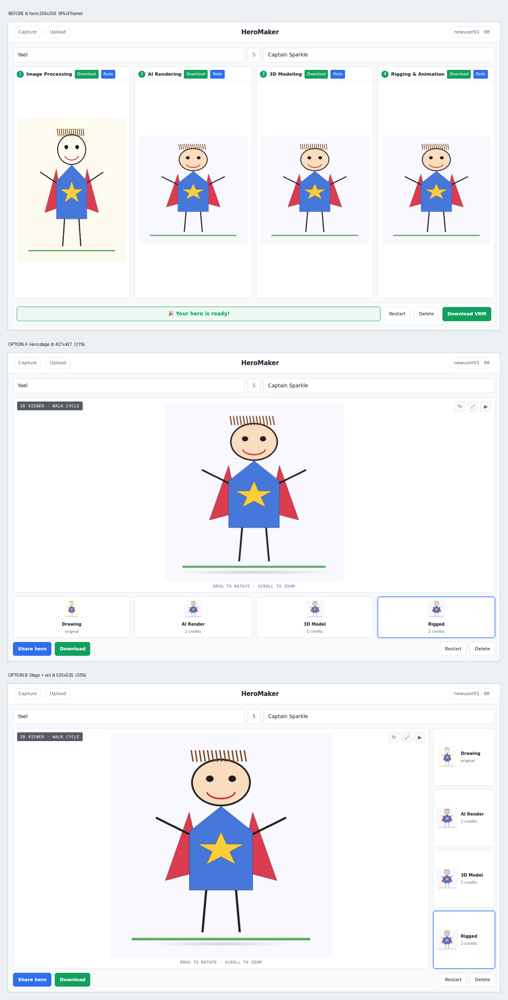

# Proposals — pick what to build

Two things live here: an **interactive mock** of the creation view with three
layouts to choose between, and the **before/after numbers** for the asset work
that is already implemented on this branch.

## 1. Creation view — choose a layout

Open **[`creation-view-mock.html`](creation-view-mock.html)** in a browser. It is
self-contained (no server, no build). Switch layouts, tap the step thumbnails, and
flip between desktop and phone. The readout measures how much of the frame the
hero actually occupies, live.

All three measured in the same 1180×738 frame, so the numbers are comparable:

| Layout | Hero render | Share of frame | Phone |
|---|---|---|---|
| Before (today) | 259×259 | 8% | 155×155 |
| **A · Hero stage** — stage on top, steps as a filmstrip below | 427×427 | 21% | 338×338 |
| **B · Stage + rail** — stage left, steps in a vertical rail right | **535×535** | **33%** | 338×338 |

**B gives the bigger hero on desktop**, which is not obvious up front: on a wide
frame, height is the scarce dimension for a roughly square avatar, so a filmstrip
that eats 92px of height costs more than a rail that eats 148px of width. On phone
the two converge, because the rail drops to a horizontal strip anyway.

Both options also:

- Promote **Share** to a primary action next to Download, instead of the
  copy-link button currently buried inside one step card.
- Stack the action bar into full-width buttons on phone, so nothing clips
  mid-word the way "Redo" and "Download VRM" do today.
- Keep every step reachable — clicking a thumbnail swaps what the stage shows,
  so the pipeline is still inspectable without giving it equal billing.

**Trade-off to decide:** A is the simpler story ("here is your hero"), B keeps the
pipeline the customer paid for visible and makes re-running a single step easy.

The stage in the mock shows the AI-rendered image as a stand-in. In the real build
it is the live three.js canvas.

## 2. Asset weight — implemented, not a proposal

Already done on this branch and verified against a production build with Playwright.

| | Before | After |
|---|---|---|
| First paint | 1076 KB | **278 KB** |
| Service worker precache | 3945 KiB | **293 KiB** |
| Logo files shipped | 2888 KB | **93 KB** |
| three.js on first paint | yes | **no** — arrives when a 3D view opens |

What changed:

- `logo.png` (1.9 MB) and `logo-head.png` (436 KB) were referenced by nothing and
  shipped anyway. Deleted.
- The logo that *is* used was a 586×586 / 524 KB RGBA PNG rendered at 40px, and the
  PWA manifest declared that one file as the 192, 512 *and* 1024 icon. Replaced with
  a generated set at the sizes actually used, wired up with `srcset` and intrinsic
  `width`/`height` so the header no longer shifts as it loads.
- three.js moved behind `React.lazy` (`LazyModelPreview`). Removing `three` from
  `manualChunks` was necessary too — naming it there kept it in the entry graph and
  Vite emitted a `modulepreload` that fetched all ~800 kB on first paint regardless
  of the lazy import.
- The service worker now precaches only the app shell; the 3D chunk is cached at
  runtime on first use instead of being pushed at every first-time visitor.

## Not yet proposed

The two findings that actually block revenue — no way to buy credits, and credits
charged for failed steps — are design and payment decisions, not layout ones. See
[`../PRODUCT_AUDIT_2026-08.md`](../PRODUCT_AUDIT_2026-08.md). Say which way you want
to go and I will mock those next.
